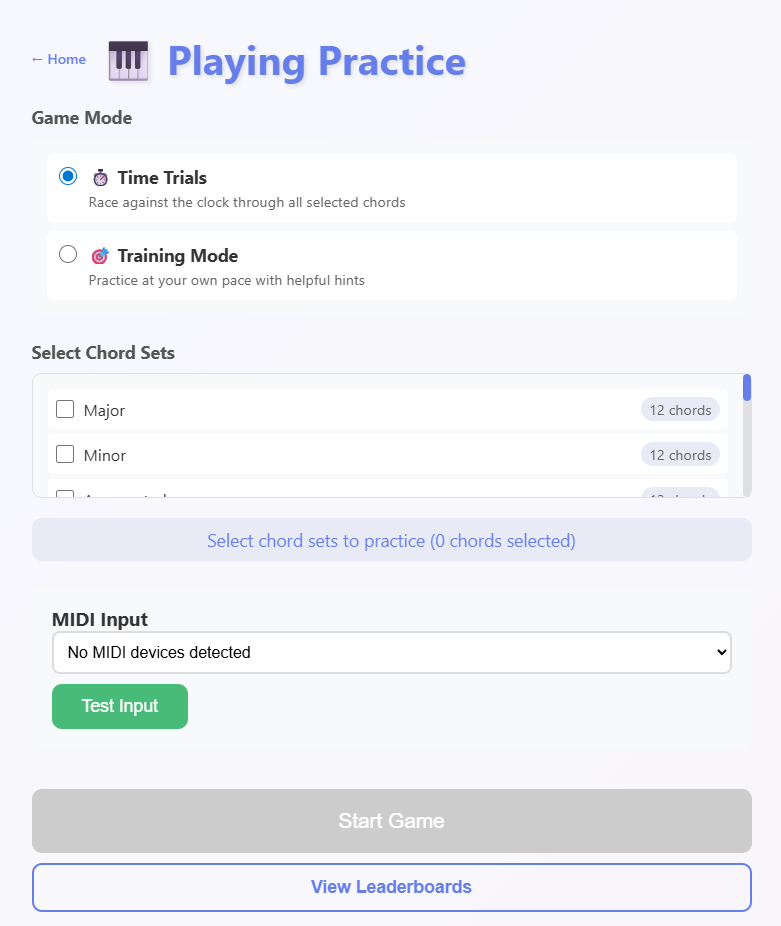

<div align="center">


# ChordCrush ♡

### ✨ *master every chord, crush every challenge* ✨

   

<br>

[](https://chordcrush.philliplavrador.com)
[](#)
[](https://nodejs.org)

<br>

> 💌 *heads up: chordcrush is still a tiny baby project! the live site might have bugs or half-built bits. feedback is always welcome ♡*

</div>

---

##  what is this lil thing?

ChordCrush is a teeny web-based chord recognition game made for pianists and music students who wanna get real good at chords. plug in a MIDI keyboard, pick your chord sets, and start playing ♪

no typing! no multiple choice! you play the **actual notes** ✿

---

##  two game modes, both super fun

<table>
<tr>
<td width="50%" valign="top">

### ⏱️ Time Trials
race the clock through every chord in your selected sets! wrong answers add a lil 5-second penalty. your best time gets saved to the leaderboard ♡

</td>
<td width="50%" valign="top">

### 🎯 Training Mode
no timer, no pressure (◕‿◕) get a chord wrong and ChordCrush shows you exactly which notes to play. missed chords cycle back around until you've got them down!

</td>
</tr>
</table>



---

##  all the lil features

###  live MIDI magic

plug in any MIDI keyboard and ChordCrush finds it automatically! notes light up on the on-screen piano in real time as you play ♪ your fav device is remembered between sessions ♡

###  a whole bunch of chords

**72+ chords** across 6 cute categories, all 12 keys:

- ♡ Major & Minor Triads
- ♡ Augmented & Diminished Triads
- ♡ Suspended 2nd & Suspended 4th

full enharmonic equivalent support (C♯ = D♭ and friends) so any valid spelling works ✿

###  leaderboards!!

save your Time Trials scores with your name ♡ leaderboards are grouped by chord sets so you can track progress across different combos. a name dropdown even remembers your most-used player names (◠‿◠)

###  smart training deck

in Training Mode, ChordCrush uses a spaced-repetition-style deck system:
- get a chord right first try → it's done ♡
- need help → ChordCrush shows you the notes, then sends that chord to the back of the deck
- notes you've gotten right so far lock in visually on the piano ✨

---

##  what it's made of

- **frontend:** vanilla javascript (ES6 modules), HTML, CSS ♡
- **backend:** Node.js + Express (static files + JSON-file leaderboard api)
- **MIDI:** Web MIDI API
- **deployment:** Railway ♪

no database, no auth, no build step! just open the page and play ✿

---

##  run it yourself!

**you'll need:**

- Node.js 18 or newer
- a MIDI keyboard (or virtual MIDI device)
- a browser that speaks Web MIDI (Chrome is besties with it)

**then do the thing:**

```bash
git clone https://github.com/philliplavrador/ChordCrush.git
cd ChordCrush
npm install
npm start
```

open `http://localhost:3001` in Chrome and yay!! ♡

---

<div align="center">

##  license

MIT ♡ built with love by [Phillip Lavrador](https://github.com/philliplavrador)

<br>

  

</div>
